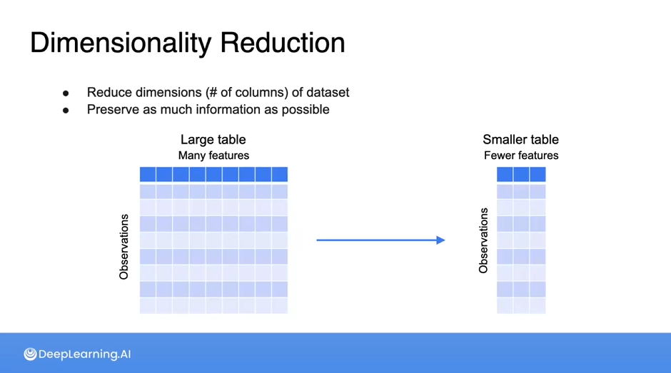
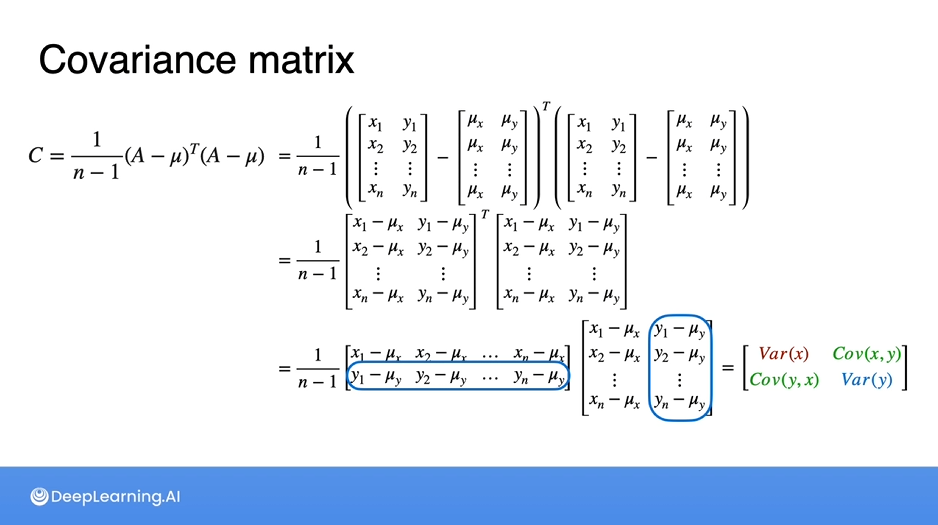
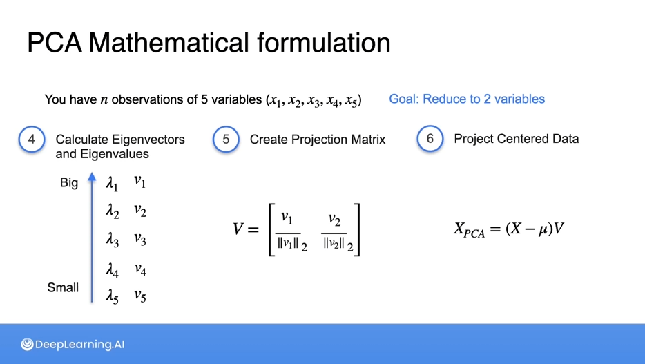

# 📘 Day 5/111 of #111DaysOfLearningForChange  
Today, I delved into key techniques in Linear Algebra and Data Science focused on simplifying complex datasets.

---

## 🔹 Dimensionality Reduction

Dimensionality reduction is a technique used to reduce the number of input variables in a dataset while preserving as much information as possible.

**Goal**: Simplify datasets without losing significant data patterns.  
**Why?** High-dimensional data can lead to overfitting, slow processing, and redundant features.

---

## 🔹 Projection

Projection is the process of mapping data from a high-dimensional space to a lower-dimensional subspace.

It helps in:
- Reducing complexity
- Retaining the essence of the original dataset in fewer dimensions

---

## 🔹 Variance and Covariance

### 🔸 Variance

Variance measures how far a set of numbers are spread out from their average value.

\[
\text{Var}(X) = \frac{1}{n} \sum_{i=1}^{n}(X_i - \bar{X})^2
\]

### 🔸 Covariance

Covariance is a measure of how much two random variables vary together.

\[
\text{Cov}(X, Y) = \frac{1}{n} \sum_{i=1}^{n}(X_i - \bar{X})(Y_i - \bar{Y})
\]

- **Positive Covariance**: Variables increase together.
- **Negative Covariance**: One increases while the other decreases.
- **Zero Covariance**: No linear relationship.

---

## 🔹 PCA (Principal Component Analysis)

PCA transforms a dataset into a new coordinate system such that the greatest variance comes to lie on the first coordinate (called the first principal component), the second greatest variance on the second coordinate, and so on.

### ✨ Steps:

1. **Standardize the dataset**

\[
X_{\text{standardized}} = \frac{X - \mu}{\sigma}
\]

2. **Compute the Covariance Matrix**

\[
\Sigma = \frac{1}{n} X^T X
\]

3. **Compute Eigenvalues and Eigenvectors**

\[
\Sigma v = \lambda v
\]

4. **Sort Eigenvectors by Decreasing Eigenvalues**

5. **Select top \(k\) eigenvectors to form the projection matrix \(W_k\)**

6. **Transform the data**

\[
X_{\text{reduced}} = X W_k
\]

---

## 🔹 Discrete Dynamical Systems

A discrete dynamical system is a system where a function describes the time evolution of a point in a geometrical space.

\[
x_{n+1} = f(x_n)
\]

- Used in: population modeling, economics, control systems, signal processing.
- Behaviors include:
  - Stable points
  - Periodic orbits
  - Chaotic dynamics

---

## 🧠 Summary

- Dimensionality reduction helps in understanding and visualizing high-dimensional data.
- Covariance and variance are foundational concepts for PCA.
- PCA simplifies data while retaining most variability.
- Discrete dynamical systems model real-world scenarios with time steps.
