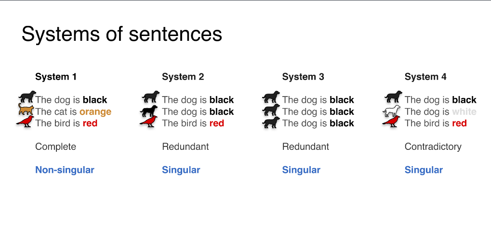
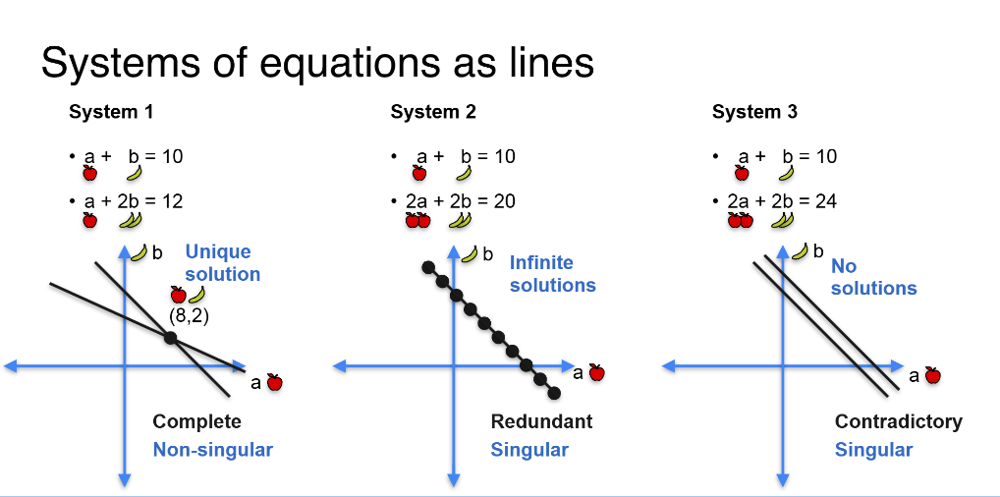
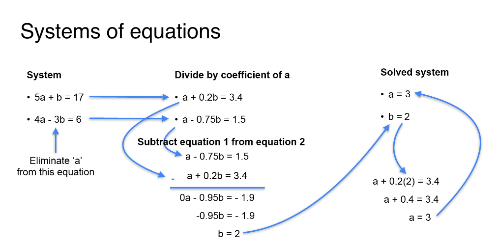

# 📚 Day 1: System of Linear Equations — AIML 111 Days Journey 🚀

---

## 1. System of Linear Equations

- A **system of linear equations** is a collection of two or more linear equations involving the same set of variables.
- Goal: Find values of variables that satisfy all equations simultaneously.

### Example:
2x + 3y = 5
x - 4y = 2

- Geometric view:  
  - Each equation is a **line**.
  - Solution = **Point where the lines intersect**.

---

## 2. Simultaneous Equations

- When multiple equations are solved together, they are called **simultaneous equations**.
- Methods to solve:
  - **Substitution method** (substitute value from one equation into another)
  - **Elimination method** (eliminate one variable by adding/subtracting equations)
  - **Matrix method** (represent as **Ax = b** and solve using Gaussian elimination or inverse matrices)

### Matrix Representation:
If,
A = Coefficient matrix
x = Variables vector
b = Constant vector

Then,
Ax = b

---

## 3. Types of Systems (Based on Solutions)

| Type            | Description                                       | Visual | System Behavior |
|-----------------|---------------------------------------------------|--------|-----------------|
| Complete        | Enough independent equations to find unique solution | Lines intersect at one point | Non-singular |
| Redundant       | Some equations are linear combinations of others (repeated info) | Infinite solutions (lines overlap) | Singular |
| Contradictory   | Equations contradict each other (no solution)       | Parallel lines (never meet) | Singular |

### 📸 Visual Explanation:

**Systems of Sentences (Analogy):**

> 

- **System 1:** Complete information (non-singular).
- **System 2/3:** Redundant information (singular but consistent).
- **System 4:** Contradictory (inconsistent information).

---

**Systems of Equations as Lines:**

> 

- **System 1:** Unique solution — two lines intersect (non-singular).
- **System 2:** Infinite solutions — lines overlap (redundant).
- **System 3:** No solutions — lines are parallel (contradictory).

---

## Solving System using Gaussian Elimination
- A systematic method of solving systems by transforming the augmented matrix into row echelon form.
- Back substitution is used after forward elimination.

## Solving System by Elimination
- Simple method by adding or subtracting equations to eliminate variables.
- Good for small systems.

## 4. Linear Dependence and Independence

- **Linearly Independent:**  
  - No equation can be formed by combining others.
  - The equations provide **new** information.
  - Necessary to have independent equations to get a unique solution.

- **Linearly Dependent:**  
  - Some equations are just scaled versions or linear combinations of others.
  - Leads to redundancy (infinite solutions) or contradictions (no solution).

### Mathematical Representation:

Equations are **linearly dependent** if:
c₁·(Eq1) + c₂·(Eq2) + ... + cₙ·(Eqn) = 0
for some non-trivial (not all zero) constants c₁, c₂, ..., cₙ.

---

## 5. System Solvability in Machine Learning

- In Machine Learning, solving systems of equations appears everywhere:
  - **Linear Regression:** Finding the best-fit line involves solving normal equations (systems).
  - **Gradient Descent:** Approximates the solution iteratively when exact solution is difficult.
  - **Feature Transformations (PCA, LDA):** Involve eigenvalues and eigenvectors — again solving matrix equations.
  - **Optimization Problems:** Formulated as systems to be solved.

💡 **Key Insight:**  
If your feature matrix (**X**) has **dependent columns** (features are redundant), your model can become unstable or non-identifiable!

---

# ✅ Summary:

- A system of linear equations is fundamental in understanding data relationships.
- Solving systems teaches you how algorithms like **Linear Regression** internally work.
- Always check for **linear independence** to avoid redundant models in ML.
- Visual intuition (graphs, geometry) is crucial in interpreting solutions.

---

