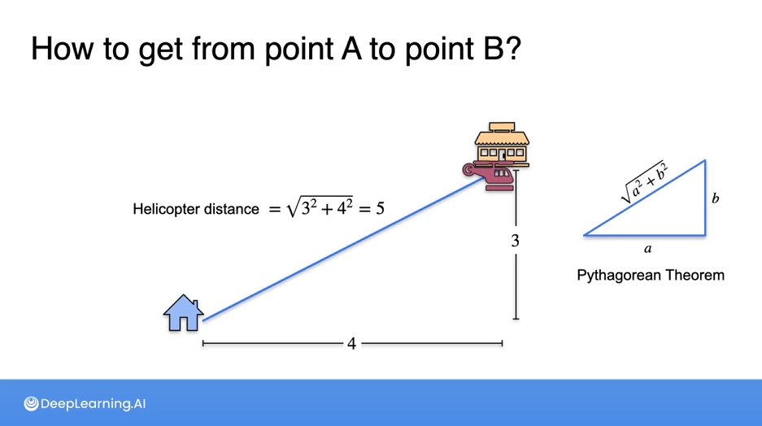

# 🧠 Vector Concepts for AI/ML

## 📌 What is a Vector?
- A **vector** is an ordered array of numbers.
- Represents **magnitude and direction** in space.
- Used to store features (data points) in AI/ML.
- **Example**: `[3, 4]` or `(height, weight)`

---

## 🔢 Vector Space
- A **vector space** is a collection of vectors that can be added together and multiplied (scaled) by numbers.
- Follows rules like associativity, commutativity, and identity.

---

## 📏 Vector Norms (Length of a Vector)
Used to measure the **size** or **distance** of a vector.

### ➤ L1 Norm (Manhattan Distance)
- Formula: `|x₁| + |x₂| + ... + |xₙ|`
- Path-like movement (up/down, left/right).
- Example: `||[3, 4]||₁ = 3 + 4 = 7`
- **Used in:** Sparse data models, Lasso regularization.

### ➤ L2 Norm (Euclidean Distance)
- Formula: `sqrt(x₁² + x₂² + ... + xₙ²)`
- Straight-line distance.
- Example: `||[3, 4]||₂ = sqrt(9 + 16) = 5`
- **Used in:** Most ML models, Ridge regularization.

### ➤ L∞ Norm (Chebyshev Distance)
- Formula: `max(|x₁|, |x₂|, ..., |xₙ|)`
- Focuses on the largest coordinate.
- Example: `||[3, 4]||∞ = 4`
- **Used in:** Robust control, some anomaly detection.

---

## 🎯 Why Use Norms?
- To measure **how far apart** data points are.
- To compare vectors regardless of direction.
- Important in **KNN**, **loss functions**, **regularization**, and **similarity search**.

---

## 🔄 Normalization
- Converts vectors to **unit length** (norm = 1).
- Formula: `v_normalized = v / ||v||`
- Used to remove scale effects in models.

---

## 🤝 Cosine Similarity
- Measures angle (not distance) between vectors.
- Formula: `cos(θ) = (A · B) / (||A|| ||B||)`
- Value ranges: `-1` (opposite) to `1` (same direction)
- Used in **text similarity**, **recommendation systems**.

---

## 📉 Regularization
Helps prevent **overfitting** in models:

- **L1 Regularization (Lasso)**: Adds `λ * ||w||₁` to loss.
  - Produces sparse models.
- **L2 Regularization (Ridge)**: Adds `λ * ||w||₂²` to loss.
  - Shrinks all weights.

---

## 📊 Visual Analogy (2D Vector [4, 3])
- **L1**: Go 4 units right, 3 up → distance = 7
- **L2**: Direct diagonal → distance = 5
- **L∞**: Max of either x or y → distance = 4

---

## 📘 Summary Table

| Norm | Name         | Formula                      | Application          |
|------|--------------|------------------------------|----------------------|
| L1   | Manhattan    | \\|x\\|₁ = Σ|xᵢ|             | Lasso, Sparse Models|
| L2   | Euclidean    | \\|x\\|₂ = sqrt(Σxᵢ²)        | Ridge, General ML   |
| L∞   | Max Norm     | \\|x\\|∞ = max(|xᵢ|)         | Robust Models       |

---

