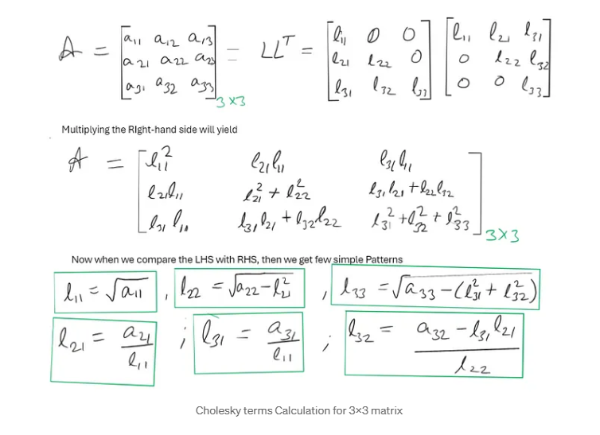

# Day 8/111 

## 🔸 Cholesky Decomposition
- Explored how to decompose a **symmetric, positive-definite matrix** into a product of a lower triangular matrix and its transpose (`A = LLᵀ`).
- This decomposition is useful for:
  - Solving linear systems efficiently
  - Optimizing numerical computations
  - Reducing complexity in multivariate Gaussian models
- Practiced deriving the decomposition manually for 3×3 matrices using step-by-step formulas.

## 🔸 Linear Algebra Review
- **Eigenvalues & Eigenvectors**: Key to dimensionality reduction and matrix transformations.
- **Principal Component Analysis (PCA)**: For reducing feature space while retaining variance.
- **Singular Value Decomposition (SVD)**: Used in matrix approximation and latent factor models.

