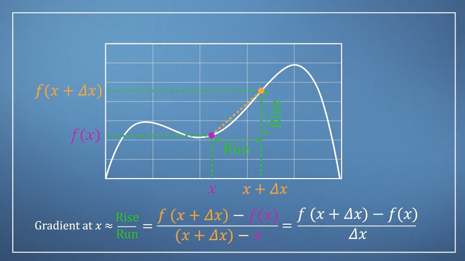
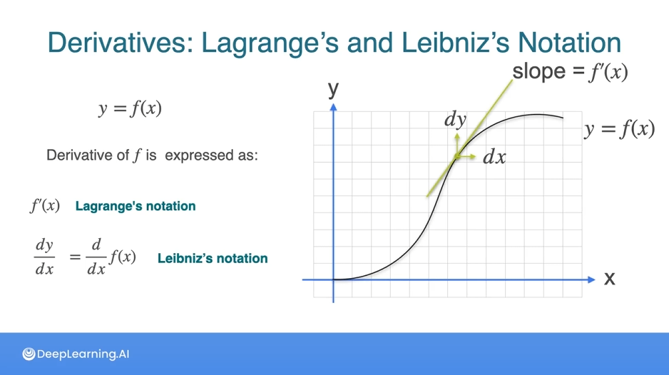

# Day 9/111

Today, I explored essential calculus concepts foundational to understanding optimization techniques:

### 1. Limits
- **Limits** define the behavior of a function as it approaches a particular point. The limit of a function \( f(x) \) as \( x \) approaches \( c \) is written as:
  \[
  \lim_{{x \to c}} f(x)
  \]
  Understanding limits is crucial for defining the derivative.

### 2. Derivatives
- **Derivatives** represent the rate of change of a function with respect to a variable. The derivative of a function \( f(x) \) is expressed as:
  \[
  \frac{dy}{dx} \quad \text{or} \quad f'(x)
  \]
  Derivatives are key to optimization problems, such as finding minimum or maximum values in functions.
  

### 3. Leibniz's & Lagrange’s Notation
- **Leibniz's notation** for derivatives is written as \( \frac{dy}{dx} \), where \( y \) is the dependent variable and \( x \) is the independent variable.
- **Lagrange’s notation** expresses the derivative as \( f'(x) \), which provides a compact and often more convenient way to represent derivatives.

