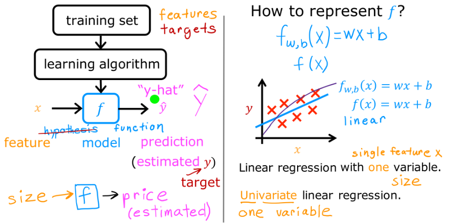
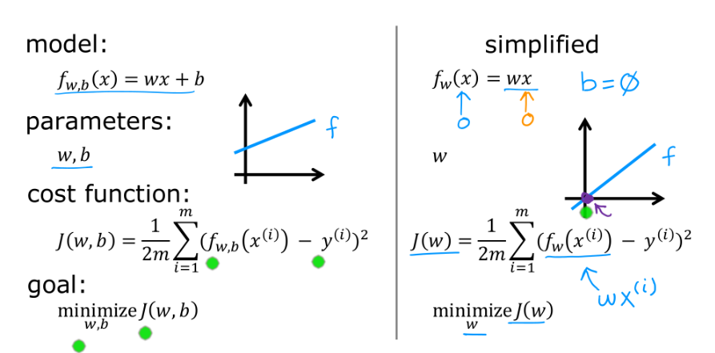
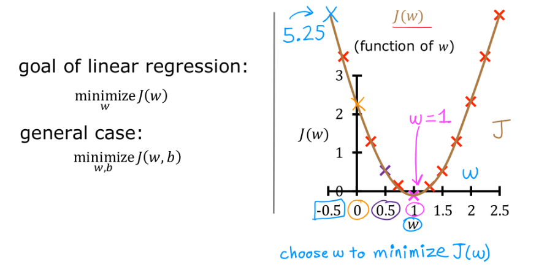

## Day 24  
### Topic: Linear Regression Fundamentals   

### Detailed Notes 📝

#### **Linear Regression Model Basics**

- Linear Regression is a supervised learning method used to predict a number (like price, temperature) using input data (x).  
- It shows a straight-line relationship: `f(x) = wx + b`  
  - `w`: weight or slope of the line  
  - `b`: bias or the y-intercept  
- Example: Used in predicting house prices or stock trends

---

#### **Model Components**

- **Training set**: Examples the model learns from  
- **Features (x)**: Inputs to the model  
- **Targets (y)**: Real output values  
- **Predictions (ŷ)**: Outputs predicted by the model  
- The model tries to make `ŷ` close to `y` using `f(x) = wx + b`

---

#### **Mathematical Framework & Cost Function**

- Model formula: `f_w,b(x) = wx + b`  
- Parameters:  
  - `w` (weight): controls the slope  
  - `b` (bias): controls the intercept  
- Simple form: `f_w(x) = wx` (when b = 0) — helps in understanding with 2D visuals  
- **Cost Function**: Measures how wrong the predictions are  
- Formula:  
J(w,b) = (1/2m) ∑(f_w,b(x⁽ⁱ⁾) - y⁽ⁱ⁾)²

- `m`: number of examples  
- `x⁽ⁱ⁾`: i-th input  
- `y⁽ⁱ⁾`: i-th actual output  

---

#### **Optimization Goal (Minimizing the Cost Function)**

- Goal: Find the best `w` and `b` that make the cost function J(w,b) as small as possible  
- Best values happen when J(w,b) is at its minimum  
- In the example graph, w ≈ 1 is where the cost is lowest

---

#### **Key Takeaways 🔑**  
- Linear regression learns a straight-line relationship between input and output  
- Model equation: `f(x) = wx + b`  
- Cost function shows prediction errors  
- We aim to reduce this error by adjusting `w` and `b`  
- Graphs and visuals help in understanding how this works
