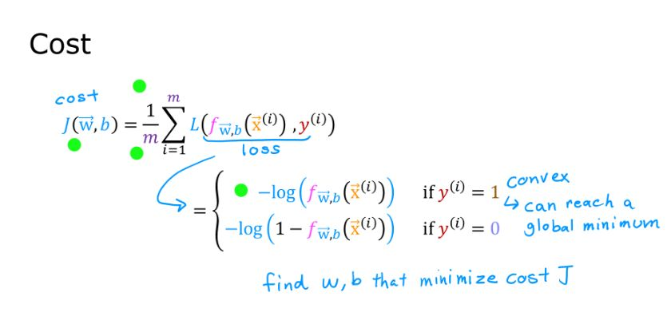

A# 📘 Topic: Cost Function and Gradient Descent in Logistic Regression

---

## ✅ Today's Learning Objectives Completed

- Understanding the log loss cost function for measuring prediction error  
- Learning how gradient descent optimizes logistic regression parameters  
- Recognizing how these methods improve classification performance  

---

## 📝 Detailed Notes

### 🔹 Cost Function: Log Loss

- Measures how well the predicted probabilities match actual labels  
- Penalizes wrong confident predictions more heavily  
- Formula:  
  \[
  J(\theta) = -\frac{1}{m} \sum_{i=1}^{m} \left[ y^{(i)} \log(h_\theta(x^{(i)})) + (1 - y^{(i)}) \log(1 - h_\theta(x^{(i)})) \right]
  \]  
- \(h_\theta(x)\) is the predicted probability from the sigmoid function  

---

### 🔹 Gradient Descent Optimization

- Iteratively updates parameters to minimize the cost function  
- Uses derivatives (gradients) of the cost with respect to parameters  
- Update rule:  
  \[
  \theta := \theta - \alpha \nabla J(\theta)
  \]  
- \(\alpha\) is the learning rate controlling step size  

---

### 🔹 Performance Improvement

- Gradient descent finds optimal parameters reducing classification error  
- Log loss provides smooth gradient aiding efficient convergence  
- Proper tuning of learning rate and iterations critical  

---

## 🔑 Key Takeaways

- Log loss cost function is suited for binary classification problems  
- Gradient descent is a powerful optimization algorithm for logistic regression  
- Together, they enable effective learning of model parameters  

---

## 💡 Practical Implementation Tips

- Monitor cost function values to check convergence during training  
- Choose appropriate learning rate to balance speed and stability  
- Use batch, stochastic, or mini-batch gradient descent depending on dataset size  
