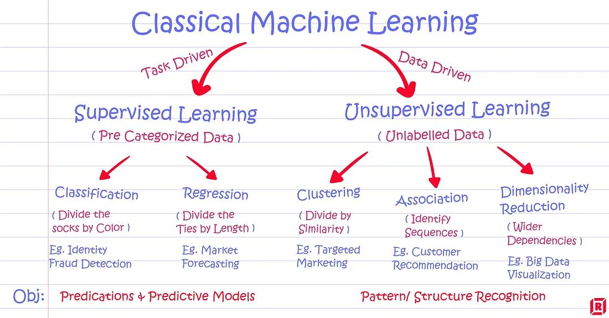
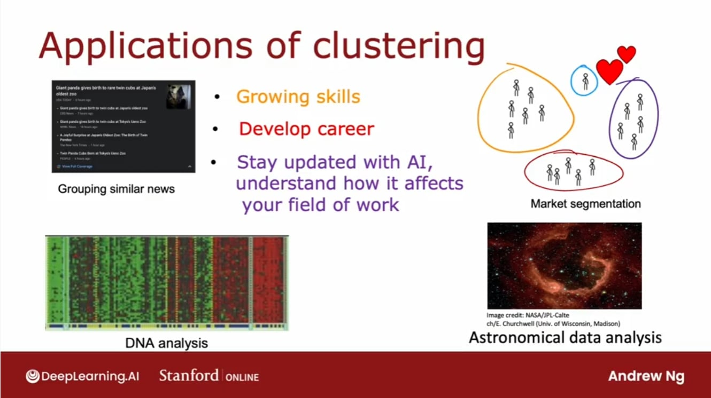

# Topic: Introduction to Unsupervised Learning & K-Means Clustering

## Today's Learning Objectives Completed

- Stepped into the world of Unsupervised Learning  
- Learned the core concept and purpose of Clustering  
- Explored the intuition and working mechanism of K-Means Clustering  

## Detailed Notes

### Unsupervised Learning Overview

- No labeled data is provided — the goal is to find hidden patterns or structures  
- Common tasks include clustering, dimensionality reduction, and anomaly detection  
- Useful when labels are unavailable or expensive to obtain  

### Clustering Concepts

- Groups data based on similarity or distance metrics  
- Helps in customer segmentation, anomaly detection, image compression, etc.  
- Cluster assignments are not predefined — the algorithm decides groupings  

## Key Takeaways

- Unsupervised learning helps extract patterns from unlabeled data  
- Clustering enables automatic group discovery  

## Practical Implementation Tips

- Always scale your features before applying K-Means  
- Use visual methods like the Elbow Plot to find a good *k*  
- Try different initializations (e.g., KMeans++) to avoid poor local minima  
