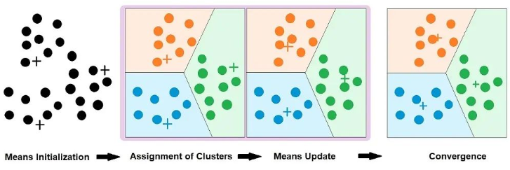
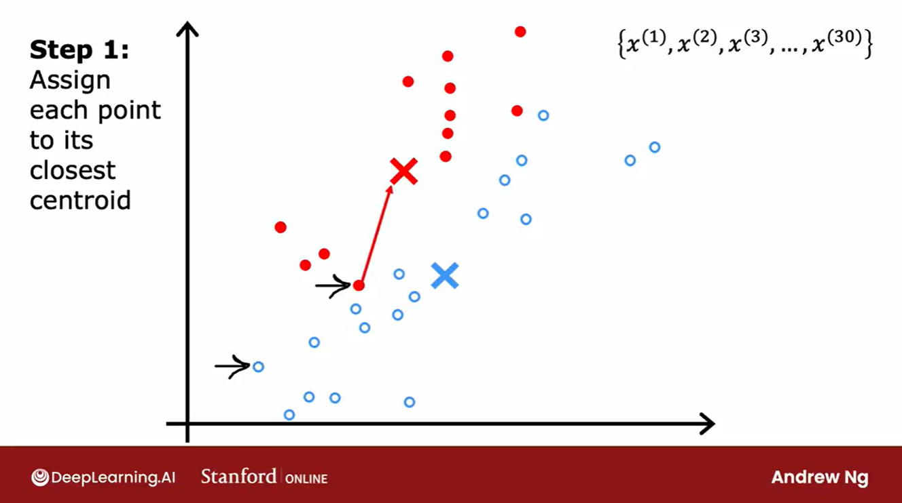
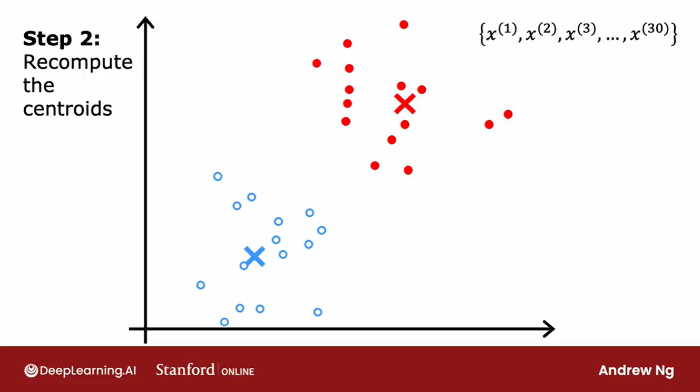

# Topic: K-Means Clustering Deep Dive

## Today's Learning Objectives Completed

- Revisited the intuition and working of K-Means Clustering  
- Studied real-world applications of K-Means  
- Understood key implementation insights and best practices  

---

## Detailed Notes

### K-Means Clustering: Concept & Process

K-Means is an unsupervised learning algorithm that groups similar data points into *k* clusters by minimizing the variance within each cluster.

#### 🔹 Steps of K-Means Algorithm

1. **Choose the number of clusters (k)**  
   Decide the value of *k*, the number of clusters you want the data to be grouped into.

   

2. **Initialize Centroids**  
   Randomly pick *k* data points as initial centroids. (Can use better strategies like KMeans++ for smarter initialization.)

3. **Assign Points to Nearest Centroid**  
   For each data point, compute the distance to each centroid and assign the point to the nearest cluster.

4. **Recompute Centroids**  
   Calculate the mean of all data points assigned to each cluster and update the centroids.

5. **Repeat Until Convergence**  
   Repeat the assignment and update steps until cluster assignments stop changing significantly or a maximum number of iterations is reached.
     
---

### Applications of K-Means

- **Customer Segmentation**: Grouping users based on behavior or demographics  
- **Image Compression**: Reducing the number of colors by clustering pixel values  
- **Document Clustering**: Grouping similar articles or texts based on content features  

---

### Implementation Insights

- **Choosing Optimal *k***: Use methods like the Elbow Method or Silhouette Score to determine the right number of clusters  
- **Feature Scaling**: Standardize features (e.g., using `StandardScaler`) to ensure equal contribution to distance metrics  
- **Categorical Data**: K-Means relies on Euclidean distance — it doesn't perform well with categorical features unless properly encoded  
- **Initialization Sensitivity**: Different initial centroids can lead to different results — run multiple initializations (e.g., `n_init=10`)  

---

## Key Takeaways

- K-Means partitions data into clusters by minimizing intra-cluster variance  
- It’s simple, fast, and effective but sensitive to initial values and outliers  
- Proper preprocessing and selection of *k* are crucial for good clustering performance  
