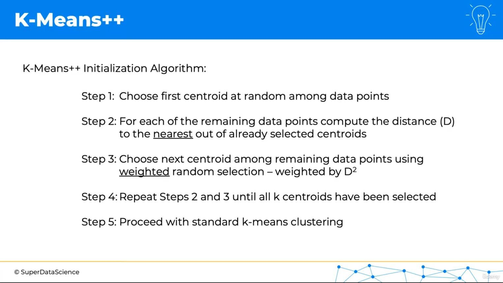

# Topic: K-Means++ Initialization and Practical Implementation

## Today's Learning Objectives Completed

- Explored K-Means++ centroid initialization to improve clustering results  
- Understood how smarter initialization leads to faster convergence and better clusters  
- Applied K-Means clustering using Scikit-learn on the Iris dataset  
- Visualized clustering results to interpret groupings  

---

## Detailed Notes

### K-Means++ Initialization

- Selects initial centroids in a way that spreads them out, reducing chances of poor clustering  
- Helps avoid local minima by starting with centroids far apart  
- Improves speed of convergence compared to random initialization  

### Practical Implementation

- Used Scikit-learn’s `KMeans` class with `init='k-means++'` parameter  
- Ran clustering on Iris dataset features  
- Visualized clusters with scatter plots showing separation and grouping  

---

## Key Takeaways

- K-Means++ is a simple yet effective enhancement over random initialization  
- Proper initialization reduces variability and improves clustering quality  
- Practical application helps solidify understanding and interpret results visually  
