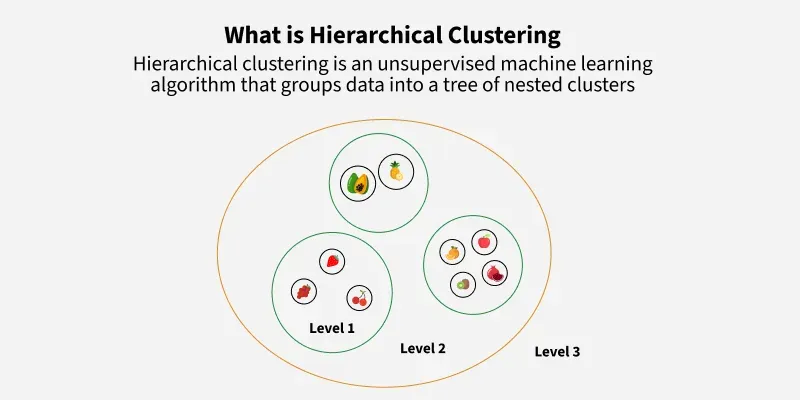
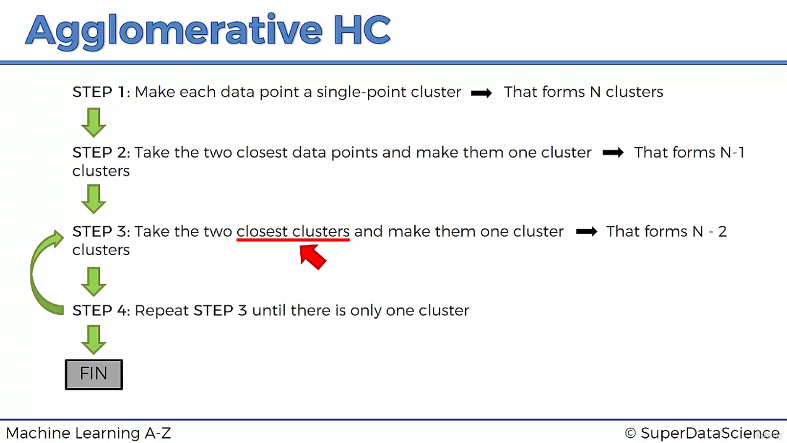

# Topic: Hierarchical Clustering

## Today's Learning Objectives Completed

- Started learning Hierarchical Clustering and how it builds nested clusters step by step  
- Explored the intuition behind agglomerative clustering methods  
- Understood key differences between Hierarchical and K-Means clustering, including flexibility, interpretability, and cluster structure  

---

## Detailed Notes

### Hierarchical Clustering Overview

- Builds clusters in a tree-like structure called a dendrogram  
- Agglomerative approach starts with each data point as its own cluster and merges them stepwise  
- Does not require specifying the number of clusters beforehand  

## Agglomerative Clustering: The Bottom-Up Approach

- Agglomerative clustering is the most common hierarchical method. It starts with each data point as an individual cluster.
- In each step, the two closest clusters are merged based on a chosen distance metric and linkage criteria.
- This merging continues until all data points belong to a single cluster or a stopping condition is met.
- The process can be visualized as a dendrogram, which shows the order of merges and the distance at which clusters are combined.

### Differences Compared to K-Means Clustering

- Hierarchical clustering produces nested clusters and a dendrogram, while K-Means produces flat clusters  
- The number of clusters in hierarchical clustering is decided by cutting the dendrogram, whereas K-Means requires specifying the number of clusters before running  
- Hierarchical clustering is more flexible and can handle clusters of different shapes, while K-Means tends to favor spherical clusters  
- Hierarchical clustering provides an easier way to visualize the cluster hierarchy and data structure  

---

## Key Takeaways

- Hierarchical clustering is useful for exploratory data analysis and understanding data relationships  
- Agglomerative methods merge the closest clusters iteratively based on linkage criteria  
- It offers a richer representation of data than flat clustering techniques  

